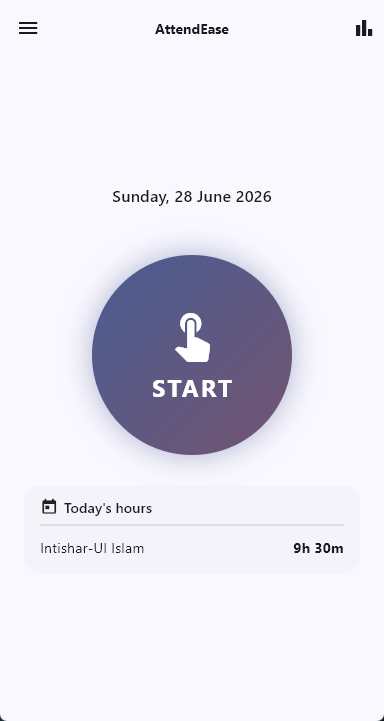
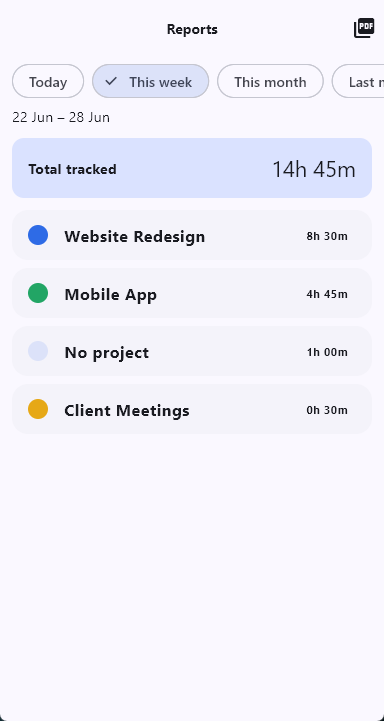
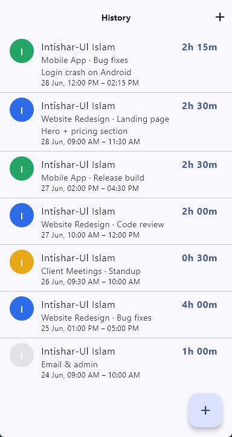

# ⏱️ AttendEase

**A simple, on-device time tracker & attendance app — built with Flutter.**

Tap **START**, optionally pick a project and type what you're working on, and a
live timer runs (with pause/resume) until you tap **STOP**. Your manager gets a
WhatsApp notification, your time is grouped into Clockify-style reports, and you
can export a colourful PDF — all stored **locally on your device**, with no
account, server, or cloud.

> Think of it as a lightweight, single-user mix of a punch clock and Clockify.

---

## ✨ Features

- ⏱️ **One-tap time tracking** — a big START/STOP button with a live `HH:MM:SS`
  timer and **pause/resume**. The session resumes automatically if you reopen the
  app mid-shift.
- 🗂️ **Projects & tasks** — organise time under colour-coded **projects** (managed
  in-app) and a free-text **task** + **description** you type each session.
- 📊 **Reports** — totals grouped by **Project → Task** with a grand total, and
  date filters: *Today, This week, This month, Last month, This year, Last year,
  Custom*.
- 📄 **PDF export** — a colourful, Clockify-style PDF (coloured total bar,
  per-project breakdown with percentages) you can **share or print**.
- 📅 **Today's hours** — a live per-person summary on the home screen.
- 📝 **History & manual entries** — browse all sessions and **add/edit/delete**
  past time entries by hand.
- 💬 **Manager notification** — on check-in/out, **WhatsApp** opens pre-filled with
  the details; you just tap *Send*. (Works with WhatsApp app/desktop, falls back
  to the browser.)
- 🔒 **100% on-device** — all data lives in a local SQLite database. No backend,
  no sign-up, no cloud.
- 🖥️📱 **Cross-platform** — runs on **Android** and **Windows** (the desktop window
  is sized like a phone for a consistent look).
- 🛟 **Friendly error handling** — clear, plain-language dialogs (with optional
  technical details) so you always know what went wrong and how to fix it.

---

## 📸 Screenshots

| Home / Timer | Reports | History |
|---|---|---|
|  |  |  |

---

## 🚀 How it works

1. **First launch** asks your **full name** once (used to tag your time; change it
   anytime in Settings).
2. Tap **START** → optionally choose a **Project**, type a **Task** and a
   **Description**, or just *Skip* to track untagged time.
3. The timer runs. **Pause/Resume** as needed — paused time is excluded from your
   worked total.
4. Tap **STOP** to finish. If you've set a manager WhatsApp number, WhatsApp opens
   pre-filled with the check-out details.
5. Open **Reports** to see totals by project/task for any date range, and tap
   **Export PDF** to share or print.

---

## 🛠️ Tech stack

| Area | Choice |
|---|---|
| Framework | **Flutter** (Material 3) |
| Language | **Dart** |
| State management | **Riverpod** (`flutter_riverpod`) |
| Local storage | **SQLite** via `sqflite` (Android) + `sqflite_common_ffi` (desktop) |
| Settings | `shared_preferences` |
| PDF | `pdf` + `printing` |
| Links / WhatsApp | `url_launcher` |
| Desktop window | `window_manager` |
| Dates | `intl` |

---

## 📁 Project structure

```
lib/
  main.dart                     App entry: ProviderScope, theme, desktop window, error handlers
  models/                       Plain data classes (Project, TimeEntry)
  providers/app_providers.dart  All Riverpod providers (settings, timer session, projects,
                                today totals, history, reports)
  services/                     Database, notifications, report aggregation, PDF building
  widgets/                      Reusable UI: project picker / START sheet, error dialogs
  screens/                      Home, Projects, Reports, History, Manual entry, Settings
test/                           Unit tests (DB migration, report aggregation) + widget test
```

See [`CLAUDE.md`](CLAUDE.md) for a deeper architecture guide.

---

## 🏁 Getting started

### Prerequisites

- [Flutter SDK](https://docs.flutter.dev/get-started/install) (stable channel)
- For Android: Android Studio / SDK + a device or emulator
- For Windows desktop: Visual Studio with the **Desktop development with C++**
  workload

### Run

```bash
git clone <your-repo-url>
cd attend_ease
flutter pub get

# Run on a connected Android device/emulator:
flutter run

# Or run on Windows desktop:
flutter run -d windows
```

### Build a release

```bash
# Android APK
flutter build apk --release

# Windows desktop (output in build/windows/x64/runner/Release/)
flutter build windows --release
```

> 💡 On Windows, close any running copy of the app before rebuilding, or the
> linker can fail to overwrite `attend_ease.exe`.

---

## ⚙️ Configuration

Everything is set inside the app — no config files needed:

- **Settings → Your name** — used to tag your time entries.
- **Settings → Manager WhatsApp** — the number that gets the check-in/out
  message. Enter **digits only, including country code** (e.g. `8801712345678`).

If no manager number is set, the timer still works — it just skips the WhatsApp
step.

---

## 🔐 Data & privacy

- All data is stored **locally** in a SQLite database in the app's documents
  directory. Nothing is uploaded anywhere.
- The only outbound action is opening **WhatsApp** (or your browser) pre-filled
  with a message — which you choose to send.

---

## 🧪 Testing

```bash
flutter analyze   # static analysis (should report no issues)
flutter test      # unit + widget tests
```

Tests cover the database migration logic, worked-time calculation, report
aggregation, and that the app boots to the START screen.

---

## 🗺️ Roadmap / ideas

- Tested on a physical Android device for PDF share + WhatsApp
- CSV export
- Weekly/automatic summaries
- Bundled font for non-Latin (e.g. Bengali) names in the PDF
- Persisting pauses across an app restart

---

## 🤝 Contributing

Issues and pull requests are welcome. Please run `flutter analyze` and
`flutter test` before opening a PR.

---

## 📄 License

Released under the MIT License — see [`LICENSE`](LICENSE). *(Add a LICENSE file if
one isn't present.)*
